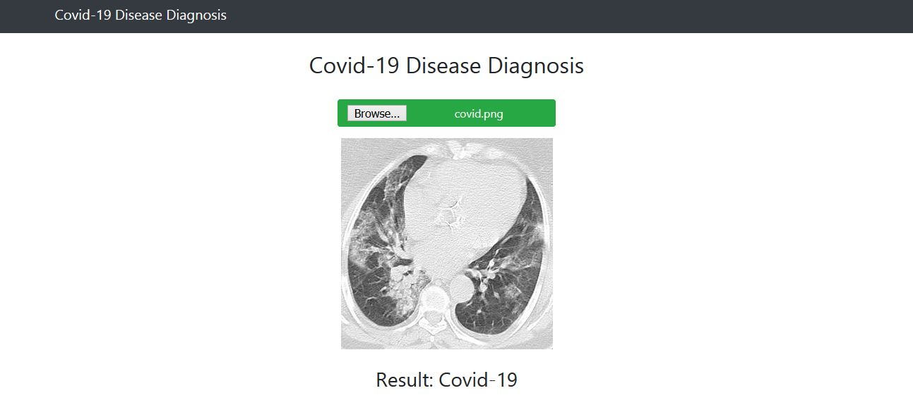

# Covid-19-Disease-Diagnosis-Flask
Covid-19 Diagnosis Python Flask Web App . It can detect COVID-19 from CT Scan Medical Images <br>

<br><br>

## Video

https://www.youtube.com/watch?v=grfnwH9s3oU

## Required Tools
```
Python 3.6 or greater, Tensorflow 2, Flask, Gevent, Scikit Learn, Scikit Image
```

## Run
```
flask run
```

Open Browser at http://121.0.0.1:5000

## Dataset

https://www.kaggle.com/plameneduardo/sarscov2-ctscan-dataset


## Research Code

https://www.kaggle.com/shawon10/covid-19-diagnosis-from-images-using-densenet121/


